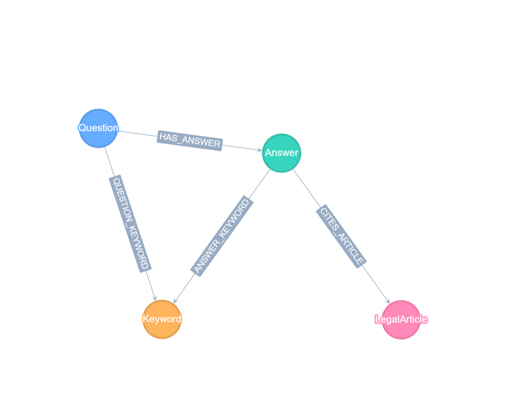

# Hw04 基于法律QA的知识图谱与问答系统搭建
## 项目介绍
  知识图谱与大模型在各大行业广泛运用，本次使用法律问答对数据，以及结合大模型技术来搭建一个智能问答系统

## 数据与模型介绍 
  采用的数据为:https://huggingface.co/datasets/ShengbinYue/DISC-Law-SFT  
  
  采用的模型为:https://huggingface.co/ShengbinYue/LawLLM-7B  
  
  这个数据的设计本意是用来进行监督微调，强化反馈的，这里我们拿他来抽取实体，采用本地部署的方式  
  
  由于开源公开的法律词典难以获得，使用jieba等库，没有经过专业的法律词汇的训练，因此结合大模型与jieba共同抽取实体：
  ```python
import re
import json
import pandas as pd
import torch
import jieba
import jieba.analyse
from vllm import LLM, SamplingParams
from collections import defaultdict
from tqdm import tqdm
import os


class LegalKnowledgeBase:
    def __init__(self):
        self.vocab = {
            "法律名称": set(),
            "条款编号": set(),
            "法律概念": set()
        }
        self.article_index = {}
        self.keyword_index = defaultdict(list)

    def build_from_reference(self, jsonl_path):
        ref_pattern = r'《([^》]+)》第([0-9一二三四五六七八九十百零]+)条[：:](.+)'

        with open(jsonl_path, 'r', encoding='utf-8') as f:
            for line in tqdm(f, desc="解析Reference"):
                data = json.loads(line)
                for ref in data.get('reference', []):
                    match = re.search(ref_pattern, ref)
                    if match:
                        law_name = match.group(1)
                        article_num = match.group(2)
                        content = match.group(3).strip()

                        self.vocab["法律名称"].add(law_name)
                        full_article = f"《{law_name}》第{article_num}条"
                        self.vocab["条款编号"].add(full_article)

                        key = (law_name, article_num)
                        self.article_index[key] = {
                            "full_name": full_article,
                            "content": content,
                            "raw": ref
                        }

                        keywords = jieba.analyse.extract_tags(
                            content, topK=10, withWeight=False)
                        for kw in keywords:
                            self.keyword_index[kw].append(key)
                            self.vocab["法律概念"].add(kw)

        print(f"知识库构建完成:")
        print(f"  - 法律名称: {len(self.vocab['法律名称'])} 个")
        print(f"  - 条款数量: {len(self.article_index)} 条")
        print(f"  - 关键词数: {len(self.keyword_index)} 个")
        return self

    def search_articles(self, query, top_k=5):
        query_keywords = jieba.analyse.extract_tags(
            query, topK=5, withWeight=False)

        article_scores = defaultdict(int)
        for kw in query_keywords:
            for article_key in self.keyword_index.get(kw, []):
                article_scores[article_key] += 1

        ranked = sorted(article_scores.items(),
                        key=lambda x: x[1], reverse=True)
        return [self.article_index[k] for k, _ in ranked[:top_k]]


class SimpleLegalExtractor:

    def __init__(self, model_path):
        self.llm = LLM(
            model=model_path,
            tensor_parallel_size=1,
            gpu_memory_utilization=0.7,
            trust_remote_code=True
        )
        self.tokenizer = self.llm.get_tokenizer()

    def parse_json(self, text):
        try:
            return json.loads(text.strip())
        except:
            try:
                def fix_keywords(match):
                    keywords = [match.group(1)]
                    remaining = text[match.end():]
                    extra_kw = re.findall(
                        r',\s*"([^"]+)"(?=\s*[,}])', remaining[:100])
                    keywords.extend(extra_kw)
                    return f'"关键词": {json.dumps(keywords, ensure_ascii=False)}'

                text = re.sub(pattern, fix_keywords, text, count=1)

                if not text.strip().endswith('}'):
                    text = text.rsplit(',', 1)[0] + '}'
                return json.loads(text)
            except Exception as e:
                print(f"修复失败: {e}")
                try:
                    laws = re.findall(r'"法律名称":\s*"([^"]+)"', text)
                    articles = re.findall(r'"条款编号":\s*"([^"]+)"', text)
                    keywords = re.findall(
                        r'"([^"]+)"(?=\s*[,}])', text.split('"关键词"')[1] if '"关键词"' in text else "")

                    return {
                        "法律名称": laws,
                        "条款编号": articles,
                        "关键词": keywords[:7]  # 限制数量
                    }
                except:
                    pass
        return {}

    def extract_answer_entities(self, texts):
        prompts = []
        for text in texts:
            content = f"""从以下法律文本中提取信息，严格按JSON格式输出：

文本：
{text}

提取规则：
1. 法律名称：书名号《》内的完整法律名称
2. 条款编号：包含"第X条"的完整描述
3. 关键词：使用分词提取的核心概念（3-5个即可）

** 输出示例（严格遵守）：**
{{"法律名称": ["中华人民共和国劳动法"], "条款编号": ["第二十五条"], "关键词": ["劳动能力", "鉴定", "期限"]}}

注意：
- 所有字段值都必须是数组[]
- 关键词用逗号分隔并放在数组内
- 不要有多余的逗号
JSON："""

            messages = [
                {"role": "system", "content": "你是信息抽取助手，只输出JSON，不要解释。"},
                {"role": "user", "content": content}
            ]
            prompts.append(
                self.tokenizer.apply_chat_template(
                    messages,
                    tokenize=False,
                    add_generation_prompt=True
                )
            )

        outputs = self.llm.generate(
            prompts,
            SamplingParams(
                temperature=0.1,
                max_tokens=256,
                stop=["}", "\n\n"]
            )
        )

        results = []
        for i, o in enumerate(outputs):
            raw_output = o.outputs[0].text
            if not raw_output.strip().endswith('}'):
                raw_output += '}'

            parsed = self.parse_json(raw_output)
            if not parsed:
                print(f"[警告] 第{i}条解析失败")
                print(f"原始输出: {raw_output[:200]}")
            results.append(parsed)

        return results

    def regex_extract(self, text):
        return {
            "法律名称": list(set(re.findall(r'《([^》]+)》', text))),
            "条款编号": list(set(re.findall(r'《[^》]+》第[0-9一二三四五六七八九十百零]+条', text))),
            "关键词": jieba.analyse.extract_tags(text, topK=5, withWeight=False)
        }


def normalize_entity_result(entities):
    if not entities:
        return {"法律名称": [], "条款编号": [], "关键词": []}

    normalized = {}
    for key in ["法律名称", "条款编号", "关键词"]:
        value = entities.get(key, [])
        if isinstance(value, str):
            normalized[key] = [value] if value else []
        elif isinstance(value, list):
            normalized[key] = value
        else:
            normalized[key] = []

    return normalized


def run_pipeline(qa_path, ref_path, model_path, output_path, batch_size=100, start_from=0, debug_mode=False):
    kb = LegalKnowledgeBase().build_from_reference(ref_path)

    # 第二步：初始化抽取器
    extractor = SimpleLegalExtractor(model_path)

    # 第三步：读取QA数据
    df = pd.read_json(qa_path, lines=True)
    total_count = len(df)
    questions = df['input'].tolist()
    answers = df['output'].tolist()

    if debug_mode:
        print(f"调试模式：只处理第一个batch ({batch_size}条)")
        total_count = min(batch_size, total_count)

    # 第四步：处理数据
    final_results = []
    if start_from > 0 and os.path.exists(output_path):
        print(f"加载已有结果: {output_path}")
        with open(output_path, 'r', encoding='utf-8') as f:
            final_results = json.load(f)
        print(f"已处理: {len(final_results)} 条")

    for batch_start in range(start_from, total_count, batch_size):
        batch_end = min(batch_start + batch_size, total_count)
        print(f"\n{'='*60}")
        print(f"处理批次: [{batch_start}, {batch_end}) / {total_count}")
        print(f"{'='*60}")

        # 当前批次数据
        batch_df = df.iloc[batch_start:batch_end]
        questions = batch_df['input'].tolist()
        answers = batch_df['output'].tolist()

        # 批量抽取答案实体
        print("正在抽取答案实体...")
        answer_entities = extractor.extract_answer_entities(answers)

        # 逐条处理
        batch_results = []

        for i in tqdm(range(len(questions)), desc=f"批次进度"):
            question = questions[i]
            answer = answers[i]

            # Question部分：关键词提取
            q_keywords = jieba.analyse.extract_tags(
                question, topK=5, withWeight=False)

            # Answer部分：LLM + 正则
            a_entities = normalize_entity_result(answer_entities[i])
            regex_result = extractor.regex_extract(answer)

            for key in ["法律名称", "条款编号", "关键词"]:
                if key in regex_result:
                    combined = a_entities.get(
                        key, []) + regex_result.get(key, [])
                    a_entities[key] = list(set(combined))

            # 检索相关条款
            related_articles = kb.search_articles(question, top_k=3)

            # 组装
            global_idx = batch_start + i
            item = {
                "id": batch_df.iloc[i].get('id', f'qa_{global_idx}'),
                "question": question,
                "answer": answer,
                "extracted": {
                    "question_keywords": q_keywords,
                    "answer_entities": a_entities,
                    "related_articles": [art["full_name"] for art in related_articles]
                }
            }
            batch_results.append(item)

        related_articles = kb.search_articles(question, top_k=3)

        # 组装结果
        item = {
            "id": df.iloc[i].get('id', f'qa_{i}'),
            "question": question,
            "answer": answer,
            "extracted": {
                "question_keywords": q_keywords,
                "answer_entities": a_entities,
                "related_articles": [art["full_name"] for art in related_articles]
            }
        }

        final_results.extend(batch_results)

        # 第五步：保存结果
        with open(output_path, 'w', encoding='utf-8') as f:
            json.dump(final_results, f, ensure_ascii=False, indent=2)
        print(f"已保存进度: {len(final_results)}/{total_count} 条")

        if debug_mode:
            print("\n调试模式：第一个batch处理完成，程序退出")
            break

    # 统计信息
    print(f"\n{'='*60}")
    print(f"全部处理完成!")
    print(f"总条数: {len(final_results)}")

    success_count = sum(1 for r in final_results
                        if r['extracted']['answer_entities'].get('法律名称')
                        or r['extracted']['answer_entities'].get('条款编号'))
    print(
        f"成功抽取实体: {success_count}/{len(final_results)} ({success_count/len(final_results)*100:.1f}%)")
    print(f"最终结果: {output_path}")


if __name__ == "__main__":
    run_pipeline(
        qa_path="./autodl-tmp/DISC-Law-SFT-Pair-QA-released.jsonl",
        ref_path="./autodl-tmp/DISC-Law-SFT-Triplet-QA-released.jsonl",
        model_path="./autodl-tmp/LawLLM-7B",
        output_path="final_legal_dataset.json",
        batch_size=100,
        start_from=0
    )

  ```

    抽取实体之后，我们可以得到一个json数据，当然它不够完善，主要是因为没有词典，所以它结合了2个数据一起供大模型参考，其中pair-qa多为口语化的提问，而triplet-QA多为法律专业性数据，所以我们可以结合2者共同增强我们的数据
    这个json的一个样板如下：
    
  ```{json}
  {
    "id": "legal_question_answering_0",
    "question": "违章停车与违法停车是否有区别？",
    "answer": "对违反道路交通安全法律、法规关于机动车停放、临时停车规定的，可以指出违法行为，并予以口头警告，令其立即驶离。机动车驾驶人不在现场或者虽在现场但拒绝立即驶离，妨碍其他车辆、行人通行的处二十元以上二百元以下罚款。现在人们大多是称作违法停车，因此在法律责任上也会更多一些，不要以为违反交通规章制度问题不大，不要认为违法停车是罚款而已。",
    "extracted": {
      "question_keywords": [
        "停车",
        "违章",
        "违法",
        "区别",
        "是否"
      ],
      "answer_entities": {
        "法律名称": [],
        "条款编号": [],
        "关键词": [
          "机动车",
          "驶离",
          "罚款",
          "停车",
          "违反"
        ]
      },
      "related_articles": [
        "《行政诉讼法》第十二条",
        "《老年人权益保障法》第四十五条",
        "《商业银行法》第七十四条"
      ]
    }
  }
  ```
上图即为模板数据
## 关系抽取与模板搭建
在获取数据之后，我们要构建schema.json用于关系图的构建，同时还要上传数据到Tugraph中(这里neo4j的思路和方案类似，在帖子中不再展示，可以在项目文件中查看)
``` python
import re
import json
import os
import csv


def extract_entities(json_record, keyword_set, article_set):
    entities = {
        "vertices": {"Question": [], "Answer": [], "Keyword": [], "LegalArticle": []},
        "edges": {"HAS_ANSWER": [], "QUESTION_KEYWORD": [], "ANSWER_KEYWORD": [], "CITES_ARTICLE": []}
    }

    # 1. Question节点
    entities["vertices"]["Question"].append({
        "id": json_record["id"],
        "question_text": json_record["question"]
    })

    # 2. Answer节点
    answer_id = f"{json_record['id']}_answer"
    entities["vertices"]["Answer"].append({
        "answer_id": answer_id,
        "answer_text": json_record["answer"]
    })

    # 3. HAS_ANSWER关系
    entities["edges"]["HAS_ANSWER"].append({
        "src": json_record["id"],
        "dst": answer_id
    })

    # 4. 提取问题关键词
    for kw in json_record["extracted"]["question_keywords"]:
        if kw not in keyword_set:
            entities["vertices"]["Keyword"].append({"keyword": kw})
            keyword_set.add(kw)
        entities["edges"]["QUESTION_KEYWORD"].append({
            "src": json_record["id"],
            "dst": kw
        })

    # 5. 提取答案关键词
    for kw in json_record["extracted"]["answer_entities"]["关键词"]:
        if kw not in keyword_set:
            entities["vertices"]["Keyword"].append({"keyword": kw})
            keyword_set.add(kw)
        entities["edges"]["ANSWER_KEYWORD"].append({
            "src": answer_id,
            "dst": kw
        })

    # 6. 提取法律条文
    for article_full in json_record["extracted"]["related_articles"]:
        law_name, article_number = parse_legal_article(article_full)
        article_id = generate_article_id(law_name, article_number)

        # 只在首次出现时添加到vertices
        if article_id not in article_set:
            entities["vertices"]["LegalArticle"].append({
                "article_id": article_id,
                "article_name": article_full,
                "law_name": law_name,
                "article_number": article_number
            })
            article_set.add(article_id)

        # 边始终添加(多个Answer可以引用同一Article)
        entities["edges"]["CITES_ARTICLE"].append({
            "src": answer_id,
            "dst": article_id
        })

    return entities


def process_all_records(json_records):
    """处理所有记录,确保LegalArticle全局去重"""

    all_entities = {
        "vertices": {
            "Question": [],
            "Answer": [],
            "Keyword": [],
            "LegalArticle": []
        },
        "edges": {
            "HAS_ANSWER": [],
            "QUESTION_KEYWORD": [],
            "ANSWER_KEYWORD": [],
            "CITES_ARTICLE": []
        }
    }

    # 全局去重集合
    global_keyword_set = set()
    global_article_set = set()

    for record in json_records:
        entities = extract_entities(
            record,
            global_keyword_set,
            global_article_set
        )

        # 合并结果
        for v_type, v_list in entities["vertices"].items():
            all_entities["vertices"][v_type].extend(v_list)
        for e_type, e_list in entities["edges"].items():
            all_entities["edges"][e_type].extend(e_list)

    return all_entities


def generate_article_id(law_name, article_number):
    """生成唯一的article_id"""
    # 例如：刑法_第四百二十五条 -> xingfa_425
    import hashlib
    raw = f"{law_name}_{article_number}"
    return hashlib.md5(raw.encode()).hexdigest()[:16]


def parse_legal_article(full_article):
    """
    解析：《行政诉讼法》第十二条
    返回：("行政诉讼法", "第十二条")
    """
    pattern = r'《(.+?)》(.+)'
    match = re.match(pattern, full_article)

    if match:
        law_name = match.group(1)
        article_number = match.group(2)
        return law_name, article_number

    pattern2 = r'(.+?法)(.+)'
    match = re.match(pattern2, full_article)

    if match:
        return match.group(1), match.group(2)

    return "未知法律", full_article


def export_to_csv(all_entities, output_dir="tugraph_csv"):
    os.makedirs(output_dir, exist_ok=True)

    # 导出顶点
    # Question
    with open(f"{output_dir}/Question.csv", 'w', encoding='utf-8', newline='') as f:
        writer = csv.writer(f)
        writer.writerow(['id', 'question_text'])
        for v in all_entities["vertices"]["Question"]:
            writer.writerow([v['id'], v['question_text']])

    # Answer
    with open(f"{output_dir}/Answer.csv", 'w', encoding='utf-8', newline='') as f:
        writer = csv.writer(f)
        writer.writerow(['answer_id', 'answer_text'])
        for v in all_entities["vertices"]["Answer"]:
            writer.writerow([v['answer_id'], v['answer_text']])

    # Keyword
    with open(f"{output_dir}/Keyword.csv", 'w', encoding='utf-8', newline='') as f:
        writer = csv.writer(f)
        writer.writerow(['keyword'])
        for v in all_entities["vertices"]["Keyword"]:
            writer.writerow([v['keyword']])

    # LegalArticle
    with open(f"{output_dir}/LegalArticle.csv", 'w', encoding='utf-8', newline='') as f:
        writer = csv.writer(f)
        writer.writerow(['article_id', 'article_name',
                        'law_name', 'article_number'])
        for v in all_entities["vertices"]["LegalArticle"]:
            writer.writerow([v['article_id'], v['article_name'],
                            v['law_name'], v['article_number']])

    # 导出边
    for edge_type in ['HAS_ANSWER', 'QUESTION_KEYWORD', 'ANSWER_KEYWORD', 'CITES_ARTICLE']:
        with open(f"{output_dir}/{edge_type}.csv", 'w', encoding='utf-8', newline='') as f:
            writer = csv.writer(f)
            writer.writerow(['src', 'dst'])
            for e in all_entities["edges"][edge_type]:
                writer.writerow([e['src'], e['dst']])


with open('./lawQA_filter.json', 'r', encoding='utf-8') as f:
    records = json.load(f)

if isinstance(records, dict):
    records = [records]

all_entities = process_all_records(records)

export_to_csv(all_entities)
```

上述代码为将实体抽取，获得节点和关系边 

下面的json文件为schema.json，是图的基本构建描述

```json
{
  "schema": [
    {
      "label": "Question",
      "type": "VERTEX",
      "primary": "id",
      "properties": [
        {
          "name": "id",
          "type": "STRING"
        },
        {
          "name": "question_text",
          "type": "STRING"
        }
      ],
      "indexes": [
        {
          "name": "idx_question_text",
          "fields": [
            "question_text"
          ]
        }
      ]
    },
    {
      "label": "Answer",
      "type": "VERTEX",
      "primary": "answer_id",
      "properties": [
        {
          "name": "answer_id",
          "type": "STRING"
        },
        {
          "name": "answer_text",
          "type": "STRING"
        }
      ]
    },
    {
      "label": "Keyword",
      "type": "VERTEX",
      "primary": "keyword",
      "properties": [
        {
          "name": "keyword",
          "type": "STRING"
        }
      ],
      "indexes": [
        {
          "name": "idx_keyword",
          "fields": [
            "keyword"
          ]
        }
      ]
    },
    {
      "label": "LegalArticle",
      "type": "VERTEX",
      "primary": "article_id",
      "properties": [
        {
          "name": "article_id",
          "type": "STRING"
        },
        {
          "name": "article_name",
          "type": "STRING"
        },
        {
          "name": "law_name",
          "type": "STRING"
        },
        {
          "name": "article_number",
          "type": "STRING"
        }
      ],
      "indexes": [
        {
          "name": "idx_law_name",
          "fields": [
            "law_name"
          ]
        }
      ]
    },
    {
      "label": "HAS_ANSWER",
      "type": "EDGE",
      "constraints": [
        [
          "Question",
          "Answer"
        ]
      ]
    },
    {
      "label": "QUESTION_KEYWORD",
      "type": "EDGE",
      "constraints": [
        [
          "Question",
          "Keyword"
        ]
      ]
    },
    {
      "label": "ANSWER_KEYWORD",
      "type": "EDGE",
      "constraints": [
        [
          "Answer",
          "Keyword"
        ]
      ]
    },
    {
      "label": "CITES_ARTICLE",
      "type": "EDGE",
      "constraints": [
        [
          "Answer",
          "LegalArticle"
        ]
      ]
    }
  ]
}
```

构建图的结果为: 


